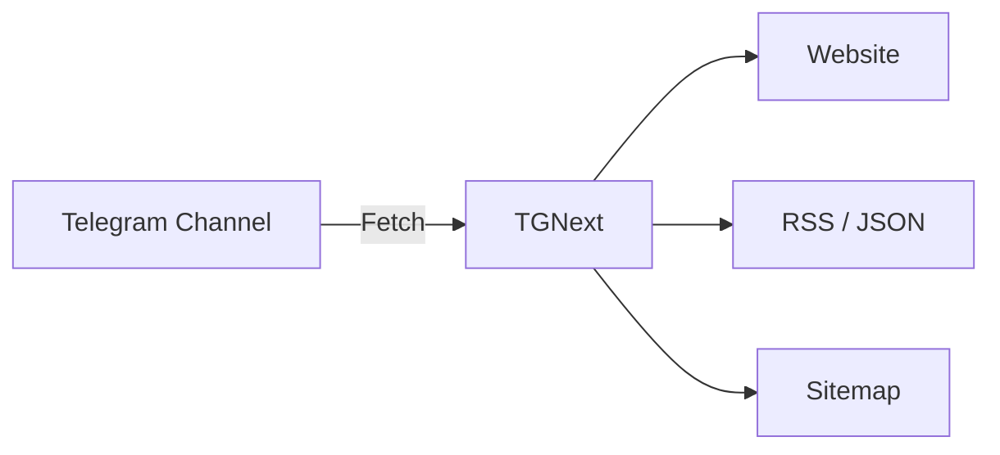

<div align="center">
  <h1>TGNext</h1>
  <p>Turn your Telegram Channel into a lightweight microblog.</p>
  <p>
    <a href="https://github.com/wintopic/TGNext"></a>
    <a href="https://astro.build/"></a>
    <a href="https://pages.cloudflare.com/"></a>
    
  </p>
  <p>
    English | <a href="./README.md">简体中文</a>
  </p>
</div>

---

<details>
<summary><strong>Table of Contents</strong></summary>

- [Overview](#overview)
- [Highlights](#highlights)
- [Architecture](#architecture)
- [Quick Start](#quick-start)
- [Deploy](#deploy)
- [Configuration](#configuration)
- [Keyword Filtering](#keyword-filtering)
- [Settings & Priority](#settings--priority)
- [FAQ](#faq)
- [License](#license)
- [Credits](#credits)

</details>

---

## Overview

TGNext is an Astro SSR microblog that turns a Telegram channel into a searchable, tag-aware, RSS-friendly site.

- Cloudflare Pages / Netlify / Vercel ready
- Single monochrome theme with light/dark mode
- 3 layouts: card / grid / masonry
- UI is Chinese-only (docs are bilingual)
- Keyword filtering across pages, RSS, and sitemap

> [!NOTE]
> Keyword filters prioritize **environment variables** and apply globally.

---

## Highlights

- **Telegram as CMS**: no backend required
- **SEO friendly**: `/sitemap.xml` + `NO_INDEX` / `NO_FOLLOW`
- **Minimal JS**: only mode/layout toggle + optional highlight
- **RSS & JSON Feed**: `/rss.xml` / `/rss.json`
- **Search & Tags**: built-in search and tag aggregation
- **Settings Page**: channel & filter settings

---

## Architecture



---

## Quick Start

```bash
git clone https://github.com/wintopic/TGNext.git
cd TGNext
pnpm install
CHANNEL=your_channel pnpm dev
```

> [!TIP]
> You can copy `.env.example` to `.env` for local configuration.

---

## Deploy

### Cloudflare Pages (Recommended)

1. Create a TGNext repo on GitHub
2. Create a Cloudflare Pages project, select `Astro`
3. Set the `CHANNEL` environment variable
4. Deploy

### Netlify / Vercel

Same flow: choose `Astro` and set `CHANNEL`.

### Build (Cloudflare Pages)

```bash
SERVER_ADAPTER=cloudflare_pages pnpm build
```

---

## Configuration

Copy `.env.example` to `.env`. At minimum, set `CHANNEL`.

### Required

| Variable  | Description               | Example        |
| --------- | ------------------------- | -------------- |
| `CHANNEL` | Telegram channel username | `your_channel` |

### Common

| Variable   | Description        | Example                     |
| ---------- | ------------------ | --------------------------- |
| `TIMEZONE` | Timezone           | `America/New_York`          |
| `TELEGRAM` | Telegram username  | `your_telegram`             |
| `TWITTER`  | X/Twitter username | `your_twitter`              |
| `GITHUB`   | GitHub username    | `your_github`               |
| `MASTODON` | Mastodon handle    | `mastodon.social/@Mastodon` |
| `BLUESKY`  | Bluesky handle     | `bsky.app`                  |
| `DISCORD`  | Discord URL        | `https://discord.com/...`   |
| `PODCAST`  | Podcast URL        | `https://podcast.com/...`   |

<details>
<summary><strong>More variables</strong></summary>

| Variable             | Description                               | Default/Example          |
| -------------------- | ----------------------------------------- | ------------------------ |
| `NO_FOLLOW`          | Disallow crawler follow                   | `false`                  |
| `NO_INDEX`           | Disallow indexing                         | `false`                  |
| `HIDE_DESCRIPTION`   | Hide channel description                  | `false`                  |
| `GOOGLE_SEARCH_SITE` | Google site search                        | `your-domain.com`        |
| `FILTER_KEYWORDS`    | Filter keywords (comma/semicolon/newline) | `spam,ads,nsfw`          |
| `TAGS`               | Tags page list                            | `tag1,tag2`              |
| `COMMENTS`           | Comments toggle                           | `true`                   |
| `REACTIONS`          | Reactions toggle                          | `true`                   |
| `LINKS`              | Links list                                | `Title,URL;Title2,URL2;` |
| `NAVS`               | Top navigation links                      | `Title,URL;Title2,URL2;` |
| `RSS_BEAUTIFY`       | Beautify RSS                              | `true`                   |
| `FOOTER_INJECT`      | Footer inject                             | HTML                     |
| `HEADER_INJECT`      | Header inject                             | HTML                     |

</details>

---

## Keyword Filtering

- Rule: case-insensitive **contains** match
- Fields: `title` / `text` / `tags`
- Scope: **list / detail / RSS / sitemap**

> [!IMPORTANT]
> If `FILTER_KEYWORDS` is set, the settings page field is disabled and the env value wins.

---

## Settings & Priority

- `/settings` lets you set **target channel** and **filter keywords**
- Values are stored in cookies
- If `CHANNEL` / `FILTER_KEYWORDS` are set in env, they take precedence
- Switch **mode** and **layout** in settings

---

## FAQ

**Why is the content empty after deployment?**

- The channel must be public
- The username is a string, not a number
- Disable “Restricting Saving Content”
- Redeploy after changing env vars
- Some channels may be blocked by Telegram

---

## License

AGPL-3.0-or-later.

---

## Credits

TGNext is forked from [BroadcastChannel](https://github.com/miantiao-me/BroadcastChannel).
