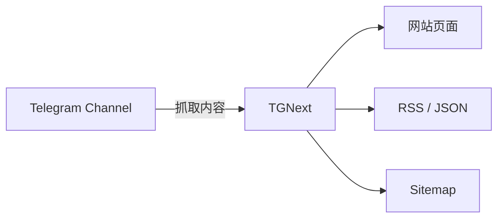

<div align="center">
  <h1>TGNext</h1>
  <p>把你的 Telegram Channel 变成轻量微博客。</p>
  <p>
    <a href="https://github.com/wintopic/TGNext"></a>
    <a href="https://astro.build/"></a>
    <a href="https://pages.cloudflare.com/"></a>
    
  </p>
  <p>
    简体中文 | <a href="./README.en.md">English</a>
  </p>
</div>

---

<details>
<summary><strong>目录</strong></summary>

- [概览](#概览)
- [功能亮点](#功能亮点)
- [架构示意](#架构示意)
- [快速开始](#快速开始)
- [部署](#部署)
- [配置](#配置)
- [关键词过滤](#关键词过滤)
- [设置页与优先级](#设置页与优先级)
- [常见问题](#常见问题)
- [许可证](#许可证)
- [致谢](#致谢)

</details>

---

## 概览

TGNext 是一个基于 Astro SSR 的轻量化站点生成器，直接把 Telegram 频道内容转成可订阅、可搜索、可标签化的微型博客站点。

- 支持 Cloudflare Pages / Netlify / Vercel
- 单一黑白风格，支持深浅模式
- 支持三种布局：卡片流 / 双排卡片流 / 瀑布流
- 多频道列表 + 顶部快速切换
- UI 固定中文（文档提供中英双语）
- 关键词过滤贯穿列表、详情、RSS、Sitemap

> [!NOTE]
> 关键词过滤规则 **环境变量优先**，并全站生效。

---

## 功能亮点

- **Telegram 频道即 CMS**：无需后台，自动抓取频道内容
- **SEO 友好**：`/sitemap.xml` 与 `NO_INDEX` / `NO_FOLLOW`
- **最小化 JS**：仅深浅模式/布局切换与可选高亮
- **RSS 与 RSS JSON**：`/rss.xml` / `/rss.json`
- **搜索 + 标签**：独立搜索页与标签聚合页
- **设置页**：支持设置目标频道、频道列表与过滤关键词

---

## 架构示意



---

## 快速开始

```bash
git clone https://github.com/wintopic/TGNext.git
cd TGNext
pnpm install
CHANNEL=your_channel pnpm dev
```

> [!TIP]
> 你也可以复制 `.env.example` 为 `.env`，在本地更方便管理配置。

---

## 部署

### Cloudflare Pages（推荐）

1. 在 GitHub 创建 TGNext 项目
2. Cloudflare Pages 新建项目，选择 `Astro`
3. 设置环境变量 `CHANNEL`
4. 保存并部署

### Netlify / Vercel

流程与 Cloudflare Pages 类似，选择 `Astro` 并配置 `CHANNEL` 即可。

### 构建命令（Cloudflare Pages）

```bash
SERVER_ADAPTER=cloudflare_pages pnpm build
```

---

## 配置

将 `.env.example` 复制为 `.env`，至少需要配置 `CHANNEL`。

### 必填

| 变量      | 说明                | 示例           |
| --------- | ------------------- | -------------- |
| `CHANNEL` | Telegram 频道用户名 | `your_channel` |

### 常用

| 变量       | 说明             | 示例                        |
| ---------- | ---------------- | --------------------------- |
| `CHANNELS` | 多频道列表       | `channel1,channel2`         |
| `TIMEZONE` | 时区             | `Asia/Shanghai`             |
| `TELEGRAM` | Telegram 用户名  | `your_telegram`             |
| `TWITTER`  | X/Twitter 用户名 | `your_twitter`              |
| `GITHUB`   | GitHub 用户名    | `your_github`               |
| `MASTODON` | Mastodon 地址    | `mastodon.social/@Mastodon` |
| `BLUESKY`  | Bluesky Handle   | `bsky.app`                  |
| `DISCORD`  | Discord 链接     | `https://discord.com/...`   |
| `PODCAST`  | Podcast 链接     | `https://podcast.com/...`   |

<details>
<summary><strong>更多配置</strong></summary>

| 变量                 | 说明                             | 默认/示例                |
| -------------------- | -------------------------------- | ------------------------ |
| `NO_FOLLOW`          | 禁止爬虫跟踪                     | `false`                  |
| `NO_INDEX`           | 禁止收录                         | `false`                  |
| `HIDE_DESCRIPTION`   | 隐藏频道简介                     | `false`                  |
| `GOOGLE_SEARCH_SITE` | Google 站内搜索                  | `your-domain.com`        |
| `FILTER_KEYWORDS`    | 过滤关键词（逗号/分号/换行分隔） | `spam,ads,nsfw`          |
| `TAGS`               | 标签页启用（逗号分隔）           | `tag1,tag2`              |
| `COMMENTS`           | 评论开关                         | `true`                   |
| `REACTIONS`          | Reactions 开关                   | `true`                   |
| `LINKS`              | Links 页面列表                   | `Title,URL;Title2,URL2;` |
| `NAVS`               | 顶部导航扩展                     | `Title,URL;Title2,URL2;` |
| `RSS_BEAUTIFY`       | RSS 美化                         | `true`                   |
| `FOOTER_INJECT`      | Footer 注入                      | HTML                     |
| `HEADER_INJECT`      | Header 注入                      | HTML                     |

</details>

---

## 关键词过滤

- 规则：大小写不敏感 **包含匹配**
- 匹配字段：`title` / `text` / `tags`
- 作用范围：**列表 / 详情 / RSS / Sitemap**

> [!IMPORTANT]
> 当 `FILTER_KEYWORDS` 存在时，设置页中对应字段会被禁用并以变量为准。

---

## 设置页与优先级

- 访问 `/settings` 可设置 **目标频道**、**频道列表** 与 **过滤关键词**
- 设置结果保存在 Cookie 中
- 若环境变量 `CHANNEL` / `CHANNELS` / `FILTER_KEYWORDS` 已配置，则优先生效
- 可在设置页切换 **深浅模式** 与 **内容布局**

---

## 常见问题

**为什么部署后内容为空？**

- 频道必须是公开频道
- 用户名是字符串而不是数字
- 关闭频道的 “Restricting Saving Content”
- 修改环境变量后需要重新部署
- 部分敏感频道可能被 Telegram 限制展示

---

## 许可证

本项目使用 **AGPL-3.0-or-later** 许可证。

---

## 致谢

TGNext 基于 [BroadcastChannel](https://github.com/miantiao-me/BroadcastChannel) 进行改造。
